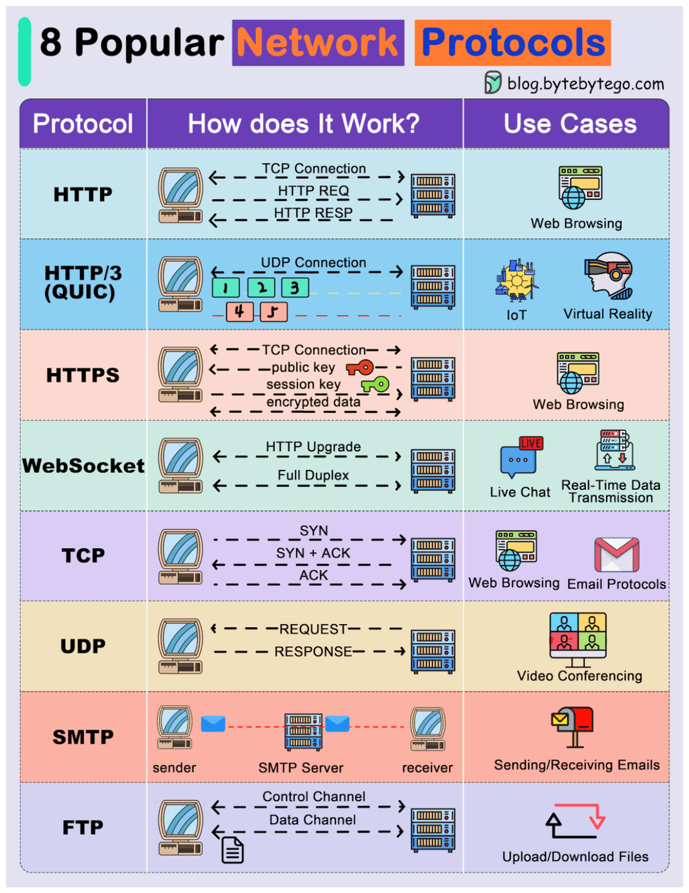
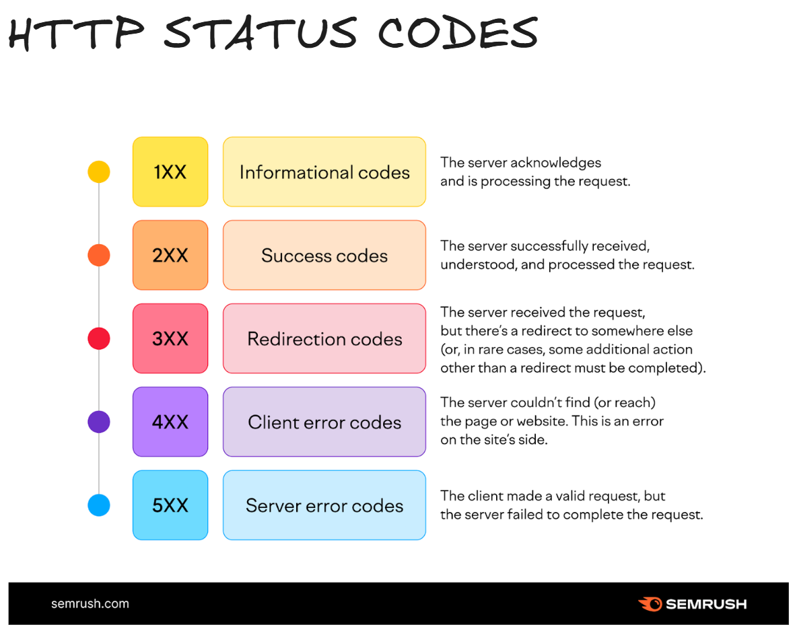

# Networking 

This Repo has all type of communication possible over the internet:
1. REST
2. Graphql
3. trpc
4. grpc
5. Polling techniques
6. WebSockets
7. WebHooks
8. WebRTC

## 8 most popular Network Protocols

## HTTP status codes

References:

https://app.excalidraw.com/l/8lwXEYCWFUz/5BWKjqfiBK6

https://www.youtube.com/watch?v=M2RpzmyKfvQ